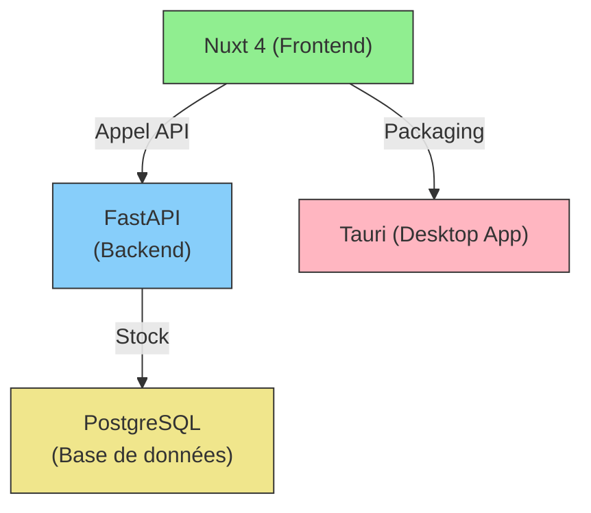

# Architecture du Projet

## 📂 Architecture des dossiers

```bash
📦 projet-final-nsi
├── 📂 frontend/              # Nuxt 4
│   ├── 📂 components/        # Composants Vue
│   │   └── 📂 ui/            # Composants réutilisables (boutons, inputs, etc.)
│   ├── 📂 pages/             # Pages principales (index.vue, login.vue)
│   ├── 📂 stores/            # Stores Pinia (auth.ts, posts.ts)
│   ├── 📄 nuxt.config.ts     # Configuration Nuxt
│   └── 📄 tailwind.config.js # Configuration TailwindCSS
│
├── 📂 backend/               # FastAPI
│   ├── 📂 api/               # Endpoints API
│   │   ├── 📄 auth.py        # Routes d'authentification
│   │   ├── 📄 posts.py       # Routes pour les posts
│   │   └── 📄 users.py       # Routes pour les utilisateurs
│   ├── 📂 models/            # Modèles SQLModel
│   │   ├── 📄 user.py        # Modèle utilisateur
│   │   └── 📄 post.py        # Modèle post
│   ├── 📂 schemas/           # Schémas Pydantic
│   ├── 📂 core/              # Configuration de base
│   │   ├── 📄 config.py      # Configuration de l'application
│   │   └── 📄 security.py    # Gestion de la sécurité (JWT, etc.)
│   ├── 📄 main.py            # Point d'entrée FastAPI
│   └── 📄 requirements.txt   # Dépendances Python
│
├── 📂 desktop/               # Tauri (Rust)
│   ├── 📂 src-tauri/         # Code source Rust
│   └── 📄 tauri.conf.json    # Configuration Tauri
│
│
├── 📂 docs/                  # Documentation
│   ├── 📄 CONTRIBUTING.md        # Guide de contribution
│
├── 📄 .gitignore             # Fichiers ignorés par Git
├── 📄 README.md              # Ce fichier

```

---

## Diagramme du projet


